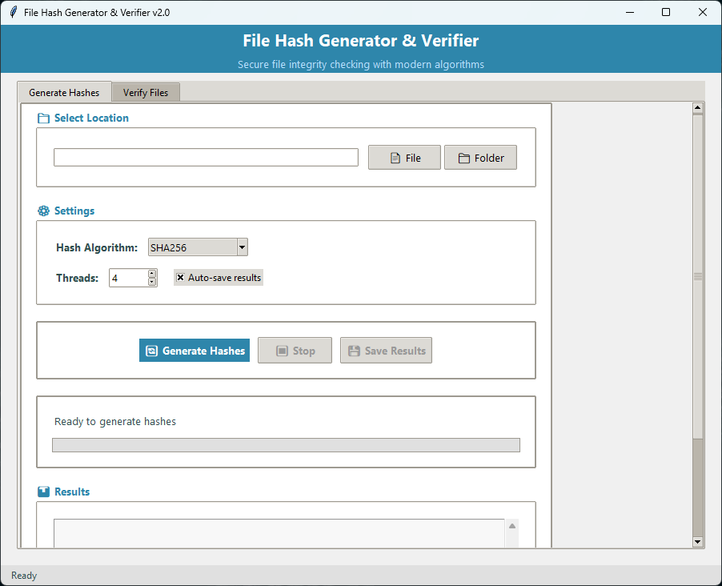
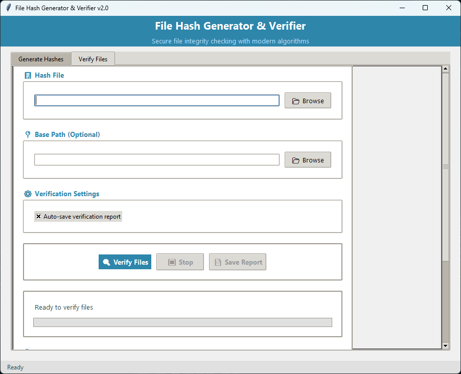

# 🔐 File Hash Generator & Verifier

[](https://github.com/mian196/Hash-Creator/actions)
[](https://github.com/mian196/Hash-Creator/releases)
[](LICENSE)
[](https://github.com/mian196/Hash-Creator/releases)

A powerful, modern cross-platform application for generating and verifying file hashes with an intuitive GUI. Perfect for ensuring file integrity, detecting corruption, and security verification.

## 📸 Screenshots

<table>
  <tr>
    <td width="50%" align="center">
      <b>Hash Generation Interface</b><br>
      <br>
      <i>Modern GUI with algorithm selection and progress tracking</i>
    </td>
    <td width="50%" align="center">
      <b>File Verification Interface</b><br>
      <br>
      <i>Comprehensive verification with corruption detection</i>
    </td>
  </tr>
</table>

## ✨ Features

### 🔢 **Comprehensive Hash Algorithm Support**
- **MD5** - Fast, widely compatible
- **SHA1** - Legacy support
- **SHA-3** - Modern secure standard
- **SHA256** - Cryptographically secure
- **SHA512** - Maximum security
- **xxHash64** - Ultra-fast non-cryptographic
- **Blake2b** - Fast and secure
- **Blake3** - Next-generation hashing
- **CRC32** - Quick checksum validation

### 🎨 **Modern User Interface**
- Beautiful, intuitive GUI with modern design
- Real-time progress tracking with file-by-file updates
- Tabbed interface for hash generation and verification
- Responsive layout that works on different screen sizes
- Dark theme support for comfortable use

### ⚡ **High Performance**
- Multi-threaded processing for optimal speed
- Configurable thread count (1-16 threads)
- Efficient memory usage for large files
- Chunked reading to handle files of any size
- Cancellable operations

### 🛡️ **Advanced Error Handling**
- Comprehensive corruption detection
- Detailed error reporting with separate error files
- Auto-save functionality with timestamps
- Graceful handling of permission errors
- Recovery from interrupted operations

### 📊 **Professional Reporting**
- JSON format for structured data storage
- Human-readable text reports
- Separate corrupted files list with hash comparisons
- Metadata including timestamps, file sizes, algorithms
- Portable path handling for cross-platform compatibility

## 🚀 Quick Start

### Option 1: Download Pre-built Executables (Recommended)
1. Go to the [Releases](https://github.com/mian196/Hash-Creator/releases) page
2. Download the appropriate file for your platform:
   - **Windows**: `Hash-Creator-windows.zip`
   - **Linux**: `Hash-Creator-linux.tar.gz`
   - **macOS**: `Hash-Creator-macos.tar.gz`
3. Extract and run - no installation required!

### Option 2: Run from Source
```bash
# Clone the repository
git clone https://github.com/mian196/Hash-Creator.git
cd Hash-Creator

# Run platform-specific setup
# Windows:
setup.bat

# Linux:
chmod +x setup.sh && ./setup.sh

# macOS:
chmod +x setup.command && ./setup.command
```

## 💻 System Requirements

| Platform | Requirements |
|----------|-------------|
| **Windows** | Windows 10 or later (64-bit) |
| **Linux** | Any modern 64-bit distribution |
| **macOS** | macOS 10.14 (Mojave) or later |

**No Python installation required for pre-built executables!**

## 🔧 Usage Guide

### Generating Hashes
1. **Select Location**: Choose a file or folder to scan
2. **Choose Algorithm**: Select from 9 supported hash algorithms
3. **Configure Settings**: Adjust thread count for performance
4. **Generate**: Click "Generate Hashes" and monitor progress
5. **Auto-Save**: Results are automatically saved with timestamps

### Verifying File Integrity
1. **Load Hash File**: Select a previously generated hash file
2. **Set Base Path**: Optionally specify new location if files moved
3. **Verify**: Click "Verify Files" to check integrity
4. **Review Results**: View detailed corruption report

### Understanding Results
- ✅ **MATCH**: File is identical to original
- ❌ **MISMATCH**: File has been modified or corrupted
- ❓ **FILE_NOT_FOUND**: Original file no longer exists
- ⚠️ **READ_ERROR**: Unable to access file
- 🚫 **VERIFICATION_ERROR**: Technical error during verification

## 🏗️ Building from Source

### Prerequisites
- Python 3.8 or higher
- pip package manager

### Setup Development Environment
```bash
# Create virtual environment
python -m venv venv

# Activate virtual environment
# Windows:
venv\Scripts\activate
# Linux/macOS:
source venv/bin/activate

# Install dependencies
pip install -r requirements.txt
```

### Run Application
```bash
python main.py
```

### Build Executable
```bash
# Using build script
python build.py

# Or manually with PyInstaller
pyinstaller --onefile --windowed --name Hash-Creator main.py
```


### Creating a Release
```bash
git tag v1.0.0
git push --tags
```

## 📂 Project Structure

```
Hash-Creator/
├── main.py                    # Main application entry point
├── requirements.txt           # Python dependencies
├── build.py                   # Build script with icon generation
├── Hash-Creator.spec   # PyInstaller configuration
├── setup.bat                  # Windows setup script
├── setup.sh                   # Linux setup script
├── setup.command              # macOS setup script
├── .github/
│   └── workflows/
│       └── build-executables.yml  # CI/CD pipeline
├── dist/                      # Built executables (generated)
├── release/                   # Release files (generated)
└── venv/                      # Virtual environment (generated)
```

## 🤝 Contributing

Contributions are welcome! Please feel free to submit a Pull Request. For major changes, please open an issue first to discuss what you would like to change.

### Development Setup
1. Fork the repository
2. Create a feature branch (`git checkout -b feature/AmazingFeature`)
3. Make your changes
4. Run tests (if applicable)
5. Commit your changes (`git commit -m 'Add some AmazingFeature'`)
6. Push to the branch (`git push origin feature/AmazingFeature`)
7. Open a Pull Request


## 🙏 Acknowledgments

- **PyInstaller** - For cross-platform executable creation
- **tkinter** - For the GUI framework
- **xxHash** - For ultra-fast hash algorithms
- **Blake3** - For next-generation cryptographic hashing
- **GitHub Actions** - For automated CI/CD pipeline

## 📈 Stats


---

<div align="center">

**Made with ❤️ for file integrity and security**

[⭐ Star this repo](https://github.com/mian196/Hash-Creator) | [🐛 Report Bug](https://github.com/mian196/Hash-Creator/issues) | [💡 Request Feature](https://github.com/mian196/Hash-Creator/issues)

</div>
